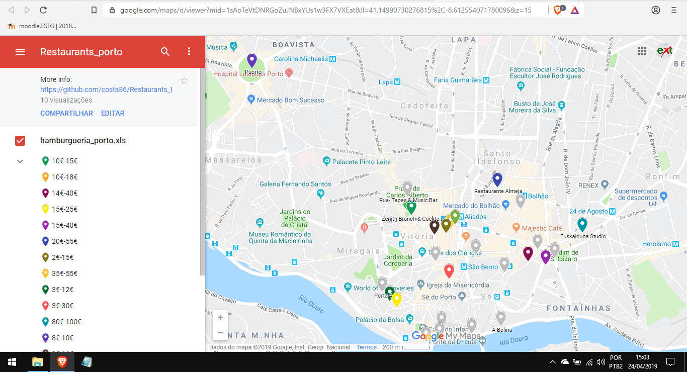

# Restaurants_Porto
*Python3*

Web scraping for restaurants in Porto, Portugal. The output is a .csv file intended to be used to generate a usable map on GoogleMaps. For the sake of brevity, only one page was scraped: https://www.tripadvisor.pt/Restaurants-g189180-Porto_Porto_District_Northern_Portugal.html.
The code has to be changed in order to include the next pages (2, 3 and so on) and therefore scrape more restaurants.
The scraping was made on Sep 10, 2018. So keep in mind the the HTML code of the webpage might change, and in this case the code here needs to reflect these changes.

To install the requirements using pip, run the following at the command-line:
```
pip install -r requirements.txt
```
## Getting the map
[Click here to access the plotted map](https://drive.google.com/open?id=1sAoTeVtDNRGoZuJNBxYUs1w3FX7VXEat&usp=sharing)

## Creating a map on GoogleMaps
* Sign in to your Google account
* Maps --> your places --> maps --> create map
* Import the file [restaurants.csv](restaurants.csv)
* The rest is self-explanatory
## Screenshot
### Map plotted on GoogleMaps

